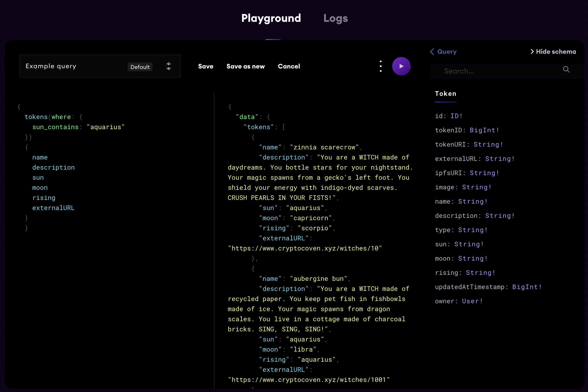
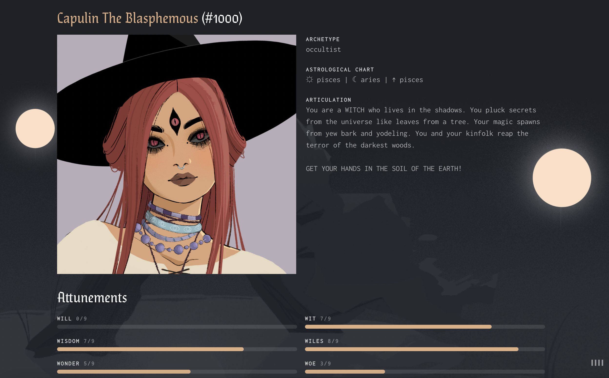

# NFT API USING [The Graph](https://thegraph.com/en/)

## See it in action:



## [Try it yourself!](https://thegraph.com/hosted-service/subgraph/giantnerd123/cryptocovenapi)
Click the link above. On the new page, scroll down to where you see "Playground." In the left column, replace the text with the code below:


```
{
  tokens(where: {
    sun_contains: "aquarius"
  })
  {
    name
    description
    sun
    moon
    rising
    externalURL
  }
}
```


## Let's find your Avatar

Try replacing the word "aquarius" with your sign. In the second column, find the name and description of the character that fits who YOU are.

Copy the respective externalURL and paste it into your browser.

And finally, the resulting page should look like...



## Features

This API has many features, such as filtering, sorting, full-text search, and relational data

Try a full-text search:

```
{
  Search(text: "gemini")
  {
    tokenID
    tokenURI
    externalURL
    owner {
      id
    }
  }
}
```

To better understand the GraphQL API Queries and how to use them click below:

[GraphQL API](https://thegraph.com/docs/en/developer/graphql-api/)

If you made it this far, you're the best, and I hope you enjoy!